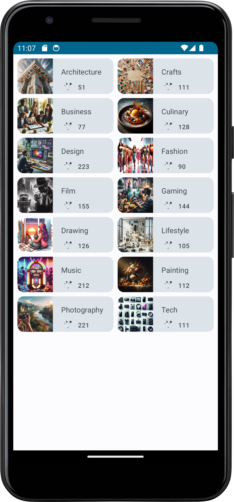

# Courses App

In this project, I proudly present the Artwork app, a personalized digital art space displaying a captivating array of artwork. I successfully built this app independently, utilizing the knowledge and skills acquired throughout my learning journey.

The app's user interface is meticulously crafted using Jetpack Compose with Kotlin, and I've implemented effective state management to ensure a seamless user experience.

## Prerequisites
Having successfully built this app, you should be familiar with the following:

- *Kotlin syntax*, including *Boolean* and when *expressions*.
- Basic *Jetpack Compose* concepts, especially the use of state with MutableState objects.
- Various composable functions like Text, Image, and Button composables.
- Translating *low-fidelity prototypes* into code.
- Constructing simple layouts with *Row* and *Column composables*, arranging them with *horizontalAlignment* and *verticalArrangement* parameters.
- Identifying states and modifying them based on triggers, such as button taps.

## What I've Learned
Through the process of building this app, I have gained valuable insights into:

- Integrating an Image composable into an Android app using Compose.
- Implementing behavior for an Image composable within an Android app with Compose.
- Navigating and modifying the Composable code structure of an Android app.

## Project Overview

- **Name**: Courses
- **Package Name**: com.example.courses
- **Minimum SDK**: 24

## Requirements
To successfully build and run this app, you will need:

- A computer with Android Studio installed.
- A collection of images that you either own or possess appropriate rights to use for your app.

